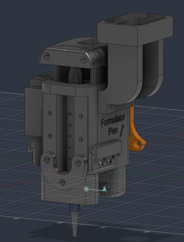

> [!NOTE]
> Except for this notice and [`MIGRATION.md`](MIGRATION.md), the current code in this
> repository is an unchanged copy of
> [`Renato-D/formulator_pen`](https://github.com/Renato-D/formulator_pen) at commit
> [`0b22b44`](https://github.com/Renato-D/formulator_pen/commit/0b22b446979a33380dfe9e5b5088c17ecdd710a4),
> shared by Renato. This repository is intended for sharing and reference, and we plan
> to develop original code based on this codebase in the future. `MIGRATION.md` contains
> information organized to support migrating Renato's code for use with the existing system.

# Dispenser Project



An automated liquid formulation dispensing system built around a **Raspberry Pi 5** host controller, one or more **Raspberry Pi Pico W** microcontrollers driving the actual dispensing hardware, a CNC gantry for positioning, and a precision balance for verifying dispensed weight.

The Pi 5 runs the whole show: it queues dispense jobs, talks to each Pico over WiFi to move a servo valve and a linear actuator (syringe pump), reads back the dispensed weight from the balance, and logs everything to Excel. This README covers everything a new user needs: what each file does, how to install and run the system, and — the part that actually requires domain judgment — how to calibrate a new fluid and tune its motion profile so it dispenses accurately without cavitating.

**Platform:** this is written for a **Raspberry Pi 5 running Raspberry Pi OS (Linux)**. Device paths, the WiFi/network tooling, and the setup commands below all assume Linux — this is not a Windows/macOS project.

---

## 1. How the system fits together

```
                     ┌─────────────────────────┐
                     │   Raspberry Pi 5 (host)  │
                     │  main_dispense_system.py │
                     └───────────┬─────────────┘
                                 │
        ┌────────────┬──────────┼───────────┬──────────────┐
        │            │          │           │              │
   USB serial   USB serial   WiFi/TCP   USB serial (see note*)
        │            │          │           │
   ┌────▼───┐   ┌────▼────┐ ┌───▼──────┐ ┌───▼─────────┐
   │  CNC   │   │ Balance  │ │ Pico W   │ │ Tool changer│
   │ (GRBL) │   │ (scale)  │ │(formulator│ │ (Arduino)   │
   └────────┘   └──────────┘ │ firmware) │ └─────────────┘
                              └───────────┘
                              valve + linear
                              actuator (syringe)
```
*The tool changer is run as its own separate script (`tool_changer.py`) before each session, not from within `main_dispense_system.py`.

- **The Pi 5** is the only thing you actually run day-to-day (`python main_dispense_system.py`). It owns the job queue, all calibration math, and result logging.
- **Each Pico W** runs one fixed firmware file (`pico_api_step.py`) that you upload *once* over USB, then never touch again for normal use. It listens for commands over WiFi and directly drives a servo valve (intake/dispense path) and a DC linear actuator with position feedback (the syringe pump).
- **The CNC** (currently disabled in `main()` pending re-integration) positions the tool over vials/containers (Look to Hiro branch and/or repo for future updates on this side as well as tool changer).
- **The balance** weighs what actually came out, so every dispense is logged with both commanded and actual weight.
- **The tool changer** (Arduino-based) physically locks/unlocks the formulator pen tool before a run.

---

## 2. Repository layout

```
Dispenser-Project/
├── requirements.txt                  # Pi 5 dependency set (installs pico-workspace's + openpyxl)
├── logs/                             # runtime logs / test output (git-ignored)
└── pico-workspace/                   # everything actually runs from here
    ├── main_dispense_system.py       # <- the program you run
    ├── wifi_link_test.py             # <- the tool you use to test a Pico after flashing
    ├── tool_changer.py               # standalone lock/unlock test for the tool changer
    ├── config.yaml                   # CNC serial port + travel limits
    ├── requirements.pi5.txt          # pinned Python deps (mpremote, pandas, pyserial, PyYAML, ...)
    ├── dispense_results.xlsx         # append-only log of every dispense (git-ignored, auto-created)
    ├── Drivers/
    │   ├── pico_api_step.py          # <- MicroPython FIRMWARE, uploaded to the Pico once
    │   ├── formulator_driver.py      # Pi5-side WiFi/TCP client for talking to a Pico
    │   ├── cnc_api.py                # GRBL/CNC motion driver
    │   ├── balance_api.py            # Serial balance driver (weigh/tare/zero)
    │   └── tool_changer_api.py       # Serial driver for the Arduino tool-changer
    └── Tests_and_Calib/
        ├── test_cnc_simple.py        # raw GRBL connectivity/movement check
        ├── valve_calibration.py      # MicroPython tool: manually jog the valve to find angles
        ├── test_formulator.py        # OUTDATED (old USB-serial driver API, see §8)
        └── ac_pen_sim_test.py        # OUTDATED (imports a module that no longer exists, see §8)
```

---

## 3. Installation

```bash
git clone <this-repo>
cd Dispenser-Project
python3 -m venv .venv
source .venv/bin/activate
pip install -r requirements.txt
```

This pulls in `pico-workspace/requirements.pi5.txt` (mpremote, pandas, pyserial, PyYAML, numpy) plus `openpyxl` for the Excel results log. `mpremote` is how you upload firmware to the Pico and (optionally) watch its USB serial console — it does **not** need to stay connected while the system runs, since normal operation is entirely over WiFi.

---

## 4. First-time setup, in order

Do these once per physical Pico. If you have multiple formulator units, repeat Step A–C for each one with a different `FORMULATOR_ID`.

### Step A — Flash the Pico firmware (USB, one-time)

1. Plug the Pico W into the Pi 5 (or any PC) over USB.
2. Open `pico-workspace/Drivers/pico_api_step.py` and edit the block that's unique to this physical unit:
   ```python
   FORMULATOR_ID = "formulator1"          # just a label, used in log lines
   WIFI_SSID = "YourNetworkName"
   WIFI_PASSWORD = "YourNetworkPassword"
   STATIC_IP = None                       # or a fixed-IP tuple, see the comment above it
   ```
   Everything else in the file is shared firmware — you generally don't need to touch it (see §7 for the one common exception: `MOTOR_FEEDBACK_PIN`/`MOTOR_IN1_PIN`/`MOTOR_IN2_PIN`/`SERVO_PIN` if your wiring differs).
3. Find the device path and upload:
   ```bash
   ls /dev/serial/by-id/                 # find the Pico's entry
   mpremote connect <that-path> cp pico-workspace/Drivers/pico_api_step.py :main.py
   ```
4. Reset it (`mpremote connect <that-path> reset`, or unplug/replug). It will auto-run `main.py` on every boot from now on — **you never need to re-upload or re-run anything over USB for normal use again**, only if you change the firmware itself or its WiFi/pin config.

### Step B — Find the Pico's IP address

Watch its USB serial console once, right after it boots:
```bash
mpremote connect <that-path> repl
```
Look for:
```
[WIFI] Connected. IP=192.168.x.x
[formulator1] WiFi command handler ready on port 8888
```
That IP is what you'll put into the Pi5-side config in Step D. Press Ctrl-] to exit the REPL — the Pico keeps running headless after you disconnect USB.

> **Two real-world gotchas that will otherwise cost you an hour:** (1) the Pico W's wireless chip is **2.4GHz only** — it can never join a 5GHz-only network, even one with the same name as a dual-band network your Pi5 might be on. (2) Many routers put "IoT"-labeled networks in an isolated VLAN with **client isolation** enabled, which lets the Pico get an IP but silently blocks the Pi5 from ever reaching it. If you can't find the Pico on the network at all, check both of these before assuming something's broken in software.

### Step C — Wire up and verify the WiFi link

Run the standalone tester (see full description in §6) against the IP from Step B:
```bash
cd pico-workspace
python wifi_link_test.py --host 192.168.x.x
```
Edit `DEFAULT_HOST` near the top of that file so you don't need `--host` every time. Run its **automated smoke test** first (option 1) — it's non-destructive (no fluid dispensed, only the valve servo moves) and confirms the whole command set works before you trust it with real hardware.

### Step D — Configure `main_dispense_system.py`

Near the top of the file:

```python
CNC_PORT = "/dev/serial/by-id/..."          # from `ls /dev/serial/by-id/`
BALANCE_PORT = "/dev/serial/by-id/..."      # from `ls /dev/serial/by-id/`

FORMULATOR_HOST = "192.168.x.x"             # the IP from Step B
FORMULATOR_TCP_PORT = 8888                  # must match FORMULATOR_TCP_PORT in the firmware
FORMULATOR_ID = "formulator1"               # just a label

FORMULATOR_FLUID_PROFILE = "SILTECH60"      # current running fluid — must be a key in FLUID_PROFILES (§7)
```

Also update `config.yaml` with the CNC's serial port and travel limits if you're using CNC positioning (currently commented out in `main()` pending re-integration — see the `# cnc = ...` lines).

### Step E — Lock the tool, then run

```bash
python tool_changer.py     # confirm lock/unlock works (edit SERIAL_PORT inside first)
python main_dispense_system.py
```

---

## 5. Running the system: the job queue model

`main_dispense_system.py` doesn't dispense immediately when called — it queues jobs, and a background task (`IntegratedDispenser.process_queue()`) works through them one at a time, waiting for the formulator's duty-cycle protection to clear between jobs if needed. You queue work with `enqueue()`, near the bottom of `main()`:

```python
dispenser.enqueue(volume_ml=1.0)                                  # draw in 1mL, then dispense it (default action="BOTH")
dispenser.enqueue(volume_ml=1.0, fluid_profile="GLYCERIN")         # same, but override the fluid for this job only
dispenser.enqueue(volume_ml=5.2, action="FILL")                   # draw in 5.2mL and hold (valve seals closed)
dispenser.enqueue(volume_ml=0.2, action="DISPENSE")                # dispense 0.2mL from whatever is currently held
dispenser.enqueue(operation_mode="PRIMING", cycles=3)              # 3 purge cycles, no volume/weighing involved
```

**`action` (NORMAL mode only)**:
| Value | What happens |
|---|---|
| `"BOTH"` (default) | Draw in `volume_ml`, then immediately dispense it back out. This is the original single-job behavior. |
| `"FILL"` | Draw in `volume_ml` and seal the valve closed — doesn't dispense. Use this to load up a larger volume once. |
| `"DISPENSE"` | Dispense `volume_ml` from whatever's currently in the syringe (from an earlier `FILL`), computed as a %-move relative to wherever the actuator currently sits — **not** an absolute volume command. Queue several of these after one `FILL` to take repeated small shots from a single draw. If there isn't enough fluid left above the safe home reference to honor the request, the move is skipped entirely (actuator doesn't move) and the job is flagged `INSUFFICIENT_VOLUME` in the results log rather than silently dispensing the wrong amount. |

**`PRIMING` mode** (`operation_mode="PRIMING"`) runs `cycles` repeated draw/dispense purge cycles in a restricted 0–40% actuator range, with no calibration or weighing — used to prime the fluid line, not to produce measured output.

Every job — regardless of mode — gets appended as a row to `dispense_results.xlsx` when it finishes (or fails), recording target vs. actual weight, actuator positions before/after, speeds, timings, and which calibration/offset values were used.

---

## 6. Testing and diagnostic tools

| Tool | What it's for | Run it |
|---|---|---|
| `wifi_link_test.py` | The main diagnostic tool for a Pico after flashing. Menu-driven: automated smoke test (safe), real actuator movement test (confirms first), reset test (verifies the Pico survives a remote reboot), a **live position monitor** for isolating ADC/wiring faults (move the actuator by hand and watch whether the reported position tracks reality), and a raw interactive console. | `python wifi_link_test.py --host <ip>` |
| `tool_changer.py` | Manually test lock/unlock against the Arduino tool changer before trusting it in a real run. | `python tool_changer.py` (edit `SERIAL_PORT` first) |
| `Tests_and_Calib/test_cnc_simple.py` | Raw GRBL connectivity/movement check, bypassing `config.yaml` and the full `CNC` class. | `python Tests_and_Calib/test_cnc_simple.py` |
| `Tests_and_Calib/valve_calibration.py` | **MicroPython** tool (not a Pi5 script) for manually jogging the valve servo to find/verify angle values, before writing them into `pico_api_step.py`'s `SERVO_POSITIONS`. | `mpremote connect <path> run Tests_and_Calib/valve_calibration.py` |

---

## 7. Configuring fluids: calibration, offsets, and step sizes

This is the section you need when adding a new fluid or improving an existing one. Everything lives in `main_dispense_system.py`'s `FLUID_PROFILES` dict — nothing here requires touching or re-flashing the Pico firmware; changed values take effect the next time `main_dispense_system.py` starts (it pushes every profile's step-limit config to the Pico automatically via `sync_all_fluid_profiles()`).

```python
"BLUESILV12": {
    "formulator_profile": "BLUESILV12",   # arbitrary token name, just needs to match FORMULATOR_FLUID_PROFILE/enqueue(fluid_profile=...)
    "calibration_offset": -0.1238,
    "calibration_slope": 0.9319,
    "multi_dispense_offset": 0.020,
    "pwm_in_percent": 25,
    "pwm_out_percent": 25,
    "relief_enabled": True,
    "in_enabled": True, "in_min_step": 0.3, "in_max_step": 1.2, "in_pause_ms": 4000,
    "out_enabled": True, "out_min_step": 0.3, "out_max_step": 10.0, "out_pause_ms": 5000,
},
```

### 7.1 `calibration_offset` / `calibration_slope` — the core volume calibration

The relationship between the volume you *command* and what actually comes out is modeled as a straight line:

```
dispensed = calibration_slope * commanded + calibration_offset
```

`main_dispense_system.py` inverts this to figure out what to command for a given desired volume:
```
commanded = (desired - calibration_offset) / calibration_slope
```

**How to derive it for a new fluid:**
1. Add a new entry to `FLUID_PROFILES` with `calibration_offset: 0`, `calibration_slope: 1` (no correction) as a starting point, and reasonable step-limit values copied from a similar-viscosity fluid already in the table.
2. Queue several jobs with `action="BOTH"` at a few different target volumes spanning your expected range (e.g. 0.2, 0.5, 1.0, 2.0 mL), each repeated a few times.
3. Compare `actual_weight_g` (from the results log) against the commanded/target volume for each run.
4. Fit a straight line: actual (y) vs. commanded (x). The slope of that fit is `calibration_slope`; the intercept is `calibration_offset`.
5. Re-run the same test volumes with the new coefficients — the actual weight should now track the target closely across the whole range, not just at one point.

### 7.2 `multi_dispense_offset` — the partial-dispense correction

This is a **separate** correction from `calibration_offset`, needed specifically for `action="DISPENSE"` (partial/delta) moves. `calibration_offset` represents a one-time bonus that only shows up on a full round trip back to home (e.g. valve reseating, pressure relief) — a delta dispense stops mid-stroke and never reaches that event, so reusing `calibration_offset` there would be wrong.

Repeated fill → multiple-partial-dispense testing showed each fluid settles (after the first shot) to a **fixed absolute gram offset** from target that's roughly constant across different target volumes — e.g. one fluid consistently overshoots by about +0.02g whether you ask for 1g or 0.2g, not by a fixed percentage.

**How to derive it:**
1. Queue one `action="FILL"` (a few mL) followed by several `action="DISPENSE"` jobs at a fixed small volume, repeated across a few independent fill cycles.
2. From the results log, exclude each fill cycle's *first* dispense (it reflects post-fill settling, not steady-state behavior) and take the mean of `actual_weight_g - volume_ml` across the rest.
3. Repeat at 2–3 different target volumes. If the mean offset (in grams, not %) is roughly the same across volumes, that's your `multi_dispense_offset`.
4. If it isn't roughly constant across volumes, this correction model doesn't fit that fluid well — leave it at `0.0` rather than guessing, and treat `calibration_slope`/`calibration_offset` as the primary lever instead.

Every dispense logs the `multi_dispense_offset_used` value in `dispense_results.xlsx`, so you can always verify what correction was actually applied to a given run.

### 7.3 `pwm_in_percent` / `pwm_out_percent` — actuator speed

Motor drive speed (0–100%) for drawing in vs. dispensing. Lower speed generally gives more consistent, less turbulent motion for viscous fluids at the cost of throughput, usually set at 25-30% ideally.

### 7.4 `relief_enabled` — pressure relief for viscous fluids

For viscous fluids, closing the valve and moving straight to dispense can trap pressure that was built up during the draw, causing an inconsistent first dispense. When `relief_enabled: True`, the system inserts a small relief move (closing the valve, backing off slightly, then opening to the dispense path) before dispensing. Enable this for anything viscous enough that you see inconsistent first-shot behavior and potential air being sucked in through valve; leave it off for low-viscosity fluids like water where it's unnecessary overhead.

### 7.5 `in_enabled`/`in_min_step`/`in_max_step`/`in_pause_ms` (and `out_*`) — stepped motion, and avoiding cavitation

This is the most important section for getting viscous fluids to dispense cleanly. The actuator can move to a target position two ways:
- **Direct**: one continuous move straight to the target.
- **Stepped**: the move is broken into several smaller sub-moves, each followed by a pause, so the fluid has time to catch up to the plunger before it moves again.

For anything past water-like viscosity, a direct move is a real risk: if the plunger moves faster than the viscous fluid can follow through the tubing, it creates a **cavitation gap** — a void between the plunger and the fluid column — which then causes inconsistent, delayed, or short dispenses as the fluid catches up unpredictably (or doesn't, until the next move). Stepped motion with pauses avoids this by never asking the fluid to keep up with more than a small increment at once.

Fields, per direction (`in_*` = drawing in, `out_*` = dispensing):
- **`*_enabled`**: whether stepped motion is used at all for this direction/fluid. Water-like fluids can usually leave this `False` (direct move is fine and faster).
- **`*_min_step`** (%): if the computed step size for a move would come out *smaller* than this, the system just does a single direct move instead of stepping — steps this tiny aren't worth the overhead.
- **`*_max_step`** (%): the largest step size allowed. The move is split into the minimum number of equal steps needed so no single step exceeds this. **This is your primary cavitation-avoidance lever** — smaller `max_step` for more viscous fluids.
- **`*_pause_ms`**: how long to pause between steps, letting the fluid settle/catch up before the next increment. More viscous fluids need longer pauses.

**Tuning heuristic:** start from a similar-viscosity fluid already in the table and adjust from there. If you observe the actuator reaching its target well before the expected weight shows up on the balance (or the dispensed weight is inconsistent run-to-run), that's a sign of cavitation — shrink `max_step` and/or lengthen `pause_ms` for that direction. If dispenses are consistent but slow, you likely have more margin than needed and can loosen (raise `max_step` / shorten `pause_ms`) to improve throughput. `SETTLE_ONLY_ON_FINAL_STEP` (in the firmware, not per-fluid) controls whether the actuator only does its full settle/tolerance-check wait on the last step of a stepped move, rather than after every intermediate step.

---

## 8. Outdated files (kept for reference, not currently functional)

Two scripts in `Tests_and_Calib/` predate the current architecture and will not run as-is:
- **`test_formulator.py`** calls `FormulatorDriver(serial_port=..., baud_rate=...)` — the driver's constructor now takes `(host, port, ...)` for the WiFi transport instead. Use `wifi_link_test.py` for formulator testing instead; it exercises the exact same driver code the production system uses.
- **`ac_pen_sim_test.py`** imports `Drivers.formulator_api`, a module that no longer exists (superseded by `pico_api_step.py` + `formulator_driver.py`). There's no direct drop-in replacement — `main_dispense_system.py`'s own job queue now covers this integration-test role.

---

## 9. Multi-Pico setups

Since each Pico is addressed by its own IP over WiFi, running more than one formulator unit doesn't need any shared-bus wiring or addressing scheme — just flash each with a distinct `FORMULATOR_ID` (Step A) and give `main_dispense_system.py` (or a per-unit copy of it) that unit's `FORMULATOR_HOST`/`FORMULATOR_ID`. `main_dispense_system.py` currently has a second unit's config commented out right above the active one as a template:
```python
FORMULATOR_HOST = "192.168.10.166"
FORMULATOR_ID = "formulatorblack"
# FORMULATOR_HOST = "192.168.10.188"
# FORMULATOR_ID = "formulatorwhite"
```

---

## 10. Troubleshooting

- **`mpremote` says the port is in use**: something else already has the serial device open — almost always a leftover `mpremote repl` session in another terminal tab that was never closed with Ctrl-]. Find it with `lsof /dev/ttyACM0` and close that session; the firmware running normally does *not* block new USB connections.
- **Can't find the Pico on the network at all**: see the two gotchas in Step B (2.4GHz-only hardware, and IoT-network client isolation).
- **Fluid profile sync fails on startup**: `main_dispense_system.py` already handles this automatically — it resets the formulator, waits for it to reboot and reconnect, and retries the sync once. If it still fails after that, the program deliberately hard-stops (rather than continuing with a possibly stale/wrong step-limit profile) and logs a `FATAL` message explaining why.
- **Watchdog / reset**: `pico_api_step.py`'s `ENABLE_WATCHDOG` auto-reboots the Pico if its whole event loop ever wedges. You can also manually reboot a Pico from the Pi5 at any time without touching USB — `FormulatorDriver.reset()`, or interactively via `wifi_link_test.py`'s reset test.
